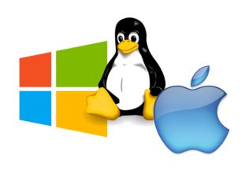
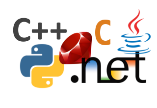

# Simple and Fast Multimedia Library

{ align=right }

## SFML is multi-media

SFML provides a simple interface to the various components of your PC, to ease the development of games and multimedia applications. It is composed of five modules: system, window, graphics, audio and network.

Discover their features more in detail in [the tutorials and the API documentation](https://www.sfml-dev.org/learn.php "Go to the tutorials and documentation page").

{ align=left }

## SFML is multi-platform

With SFML, your application can compile and run out of the box on the most common operating systems: Windows, Linux, macOS and Android & iOS (with limitations).

Pre-compiled SDKs for your favorite OS are available on the [download page](https://www.sfml-dev.org/download.php "Go to the download page").

{ align=right }

## SFML is multi-language

SFML has official bindings for the C and .Net languages. And thanks to its active community, it is also available in many other languages such as Java, Ruby, Python, Go, and more.

Learn more about them on the [bindings page](https://www.sfml-dev.org/download/bindings.php "Go to the bindings page").

