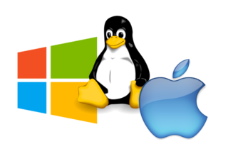
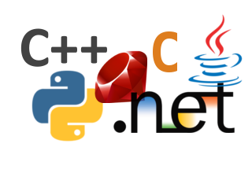

# Simple and Fast Multimedia Library

{ align=right }

## SFML est multi-media

SFML offre une interface simple vers les différents composants de votre PC, afin de faciliter le développement de jeux ou d'applications multimedia. Elle se compose de cinq modules : système, fenêtrage, graphisme, audio et réseau.

Découvrez plus en détail leurs fonctionnalités, dans [les tutoriels et la documentation de l'API](https://www.sfml-dev.org/learn-fr.php "Aller à la page des tutoriels et de la documentation").

{ align=left }

## SFML est multi-plateforme

Avec SFML, votre application peut se compiler et tourner sans effort sur la plupart des systèmes d'exploitation : Windows, Linux, macOS et Android & iOS (avec des limitations).

Des SDKs précompilés pour votre OS préféré sont disponibles sur la [page des téléchargements](https://www.sfml-dev.org/download-fr.php "Aller à la page des téléchargements").

{ align=right }

## SFML est multi-langage

SFML possède des bindings officiels pour les langages C et .Net. Et grace à sa communauté très active, elle est également disponible dans beaucoup d'autres langages tels que Java, Ruby, Python, Go et plus encore.

Apprenez-en d'avantage à leur sujet sur la [page des bindings](https://www.sfml-dev.org/download/bindings-fr.php "Aller à la page des bindings").

