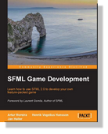
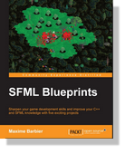
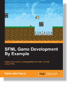
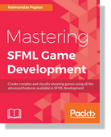

---
hide:
  - footer
---

# Learn

-   [{ align=left } __Tutorials__](../tutorials/3.0/index.md)

    Learn how to use SFML

-   [{ align=left } __API Documentation__](../documentation/3.0.1/index.html)

    Reference

-   [{ align=left } __FAQ__](../faq/index.md)

    Frequently Asked Questions

-   [{ align=left } __License__](../license.md)

    zlib/png license

## Books

!!! info "SFML Game Development"

    { align=left }

    If you've got a firm grasp of C++ with a secret hankering to create a great game, this book is for you. Every practical aspect of programming an interactive game world is here‚ the only real limit is your imagination.
  
    [https://www.packtpub.com/en-us/product/sfml-game-development-9781849696845](https://www.packtpub.com/en-us/product/sfml-game-development-9781849696845)

!!! info "SFML Blueprints"

    { align=left }

    Sharpen your game development skills and improve your C++ and SFML knowledge with five exciting projects
  
    [https://www.packtpub.com/en-us/product/sfml-blueprints-9781784398477](https://www.packtpub.com/en-us/product/sfml-blueprints-9781784398477)

!!! info "SFML Game Development By Example"

    { align=left }

    Create and develop exciting games from start to finish using SFML
  
    [https://www.packtpub.com/en-us/product/sfml-game-development-by-example-9781785287343](https://www.packtpub.com/en-us/product/sfml-game-development-by-example-9781785287343)

!!! info "Mastering SFML Game Development"

    { align=left }
    
    Inject new life and light into your old SFML projects by advancing to the next level.
  
    [https://www.packtpub.com/en-us/product/mastering-sfml-game-development-9781786469885](https://www.packtpub.com/en-us/product/mastering-sfml-game-development-9781786469885)

## Documentation for older Versions

- **SFML 3.0.0:** [Tutorials](../tutorials/3.0/index.md), [API documentation](../documentation/3.0.0/index.html)
- **SFML 2.6.2:** [Tutorials](https://www.sfml-dev.org/tutorials/2.6), [API documentation](https://www.sfml-dev.org/documentation/2.6.2)
- **SFML 2.6.1:** [Tutorials](https://www.sfml-dev.org/tutorials/2.6), [API documentation](https://www.sfml-dev.org/documentation/2.6.1)
- **SFML 2.6.0:** [Tutorials](https://www.sfml-dev.org/tutorials/2.6), [API documentation](https://www.sfml-dev.org/documentation/2.6.0)
- **SFML 2.5.1:** [Tutorials](https://www.sfml-dev.org/tutorials/2.5), [API documentation](https://www.sfml-dev.org/documentation/2.5.1)
- **SFML 2.5.0:** [Tutorials](https://www.sfml-dev.org/tutorials/2.5), [API documentation](https://www.sfml-dev.org/documentation/2.5.0)
- **SFML 2.4.2:** [Tutorials](https://www.sfml-dev.org/tutorials/2.4), [API documentation](https://www.sfml-dev.org/documentation/2.4.2)
- **SFML 2.4.1:** [Tutorials](https://www.sfml-dev.org/tutorials/2.4), [API documentation](https://www.sfml-dev.org/documentation/2.4.1)
- **SFML 2.4.0:** [Tutorials](https://www.sfml-dev.org/tutorials/2.4), [API documentation](https://www.sfml-dev.org/documentation/2.4.0)
- **SFML 2.3.2:** [Tutorials](https://www.sfml-dev.org/tutorials/2.3), [API documentation](https://www.sfml-dev.org/documentation/2.3.2)
- **SFML 2.3.1:** [Tutorials](https://www.sfml-dev.org/tutorials/2.3), [API documentation](https://www.sfml-dev.org/documentation/2.3.1)
- **SFML 2.3:** [Tutorials](https://www.sfml-dev.org/tutorials/2.3), [API documentation](https://www.sfml-dev.org/documentation/2.3)
- **SFML 2.2:** [Tutorials](https://www.sfml-dev.org/tutorials/2.2), [API documentation](https://www.sfml-dev.org/documentation/2.2)
- **SFML 2.1:** [Tutorials](https://www.sfml-dev.org/tutorials/2.1), [API documentation](https://www.sfml-dev.org/documentation/2.1)
- **SFML 2.0:** [Tutorials](https://www.sfml-dev.org/tutorials/2.0), [API documentation](https://www.sfml-dev.org/documentation/2.0)
- **SFML 1.6:** [Tutorials](https://www.sfml-dev.org/tutorials/1.6), [API documentation](https://www.sfml-dev.org/documentation/1.6)