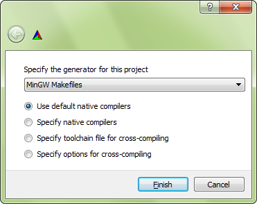
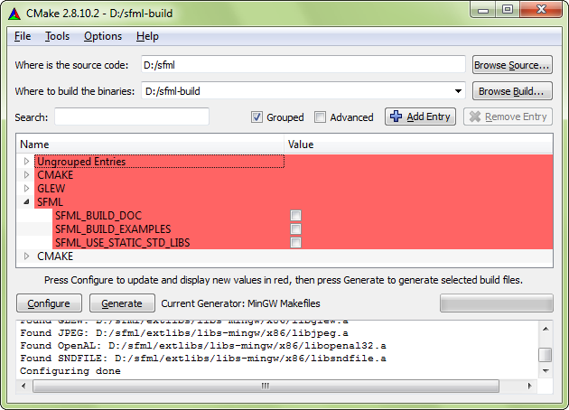
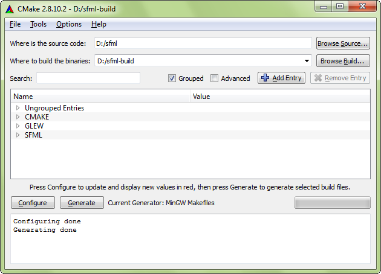

# Building SFML from Source

## Introduction

SFML's build process uses CMake.
CMake is an open-source meta build system.
It will generate a build system which then does the actual compilation and linking.
CMake generators include Visual Studio solutions, Code::Blocks projects, Ninja build files, Linux Makefiles, and XCode projects among others.
It is similar to autoconf/automake or premake for those who are already familiar with these tools.

CMake is used by many projects including well-known ones such as Minecraft: Bedrock Edition, LLVM, Blender, CLion, KDE, Ogre, and many more.
You can read more about CMake on its [official website](https://www.cmake.org/ "CMake official website") or in its [Wikipedia article](https://en.wikipedia.org/wiki/CMake "Wikipedia page of CMake").

As you might expect, this tutorial is divided into two main sections: Generating the build configuration with CMake, and building SFML with your toolchain using that build configuration.

!!! note

    The [CMake template](cmake.md) is the recommended way to get started with SFML.

## Installing dependencies

SFML depends on a few other libraries, which will be automatically built as part of the SFML project unless otherwise specified by the `SFML_USE_SYSTEM_DEPS` option (see below).
On Linux, however, this option is disabled by default, so either enable it, or ensure the following packages are installed on your system:

- freetype
- harfbuzz
- flac
- ogg
- vorbis
- vorbisenc
- vorbisfile
- mbedtls

On Linux there are also other system dependencies that must be installed in all cases:

- x11
- xrandr
- xcursor
- xi
- udev
- opengl
- pthread

The exact name of the packages may vary from distribution to distribution.
Once those packages are installed, don't forget to install their *development headers* as well.

## Configuring your SFML build

This step consists of creating the projects/makefiles that will finally compile SFML.
Basically it consists of choosing *what* to build, *how* to build it and *where* to build it.
There are several other options as well which allow you to create a build configuration that suits your needs.
We'll see that in detail later.

The first thing to choose is where the projects/makefiles and object files (files resulting from the compilation process) will be created.
You can generate them directly in the source tree (i.e. the SFML root directory), but it will then be polluted with a lot of garbage: a complete hierarchy of build files, object files, etc.
The cleanest solution is to generate them in a completely separate folder so that you can keep your SFML directory clean.
Using separate folders will also make it easier to have multiple different builds (static, dynamic, debug, release, ...).

Now that you've chosen the build directory, there's one more thing to do before you can run CMake.
When CMake configures your project, it tests the availability of the compiler (and checks its version as well).
As a consequence, the compiler executable must be available when CMake is run.
This is not a problem for most users, since the compilers are installed in a standard path and are always globally available, but in some cases you may have to add the directory of your compiler in the PATH environment variable, so that CMake can find it automatically.
This is especially important when you have several compilers installed, or multiple versions of the same compiler.

On Windows, if you want to use GCC (MinGW), you can temporarily add the MinGW\bin directory to the PATH and then run CMake from the command shell:

=== "PowerShell"

    ```powershell
    $env:PATH="$env:PATH;C:\<your_mingw_folder>\bin"
    cmake -G"MinGW Makefiles" -B ./build
    ```

=== "CMD"

    ```batch
    set PATH=%PATH%;C:\<your_mingw_folder>\bin
    cmake -G"MinGW Makefiles" -B ./build
    ```

With NMake, you can either run CMake from the "Developer command prompt" available from the start menu, or run the `vcvars32.bat` / `vcvars64.bat` batch file of your Visual Studio installation in the console you have open.
The batch file will set all the necessary environment variables in that console window for you.

=== "CMD"

    ```batch
    <your_visual_studio_folder>\VC\Auxiliary\Build\vcvars32.bat
    cmake -G"NMake Makefiles" -B ./build
    ```


Now you are ready to run CMake.
In fact there are two different ways to run it:

- **cmake-gui**  
   This is CMake's graphical interface which allows you to configure everything with buttons and text fields.
   It's very convenient to see and edit the build options and is probably the easiest solution for beginners and people who don't want to deal with the command line.
- **cmake**  
   This is the direct call to CMake.
   If you use this, you must specify all the option names and their values as command line parameters.
To print out a list of all options, run `cmake -L`.

In this tutorial we will be using cmake-gui, as this is what most beginners are likely to use.
We assume that people who use the command line variants can refer to the CMake documentation for their usage.
With the exception of the screenshots and the instructions to click buttons, everything that is explained below will apply to the command line variants as well (the options are the same).

Here is what the CMake GUI looks like:


The first steps that need to be done are as follows (perform them in order):

1. Tell CMake where the source code of SFML is (this must be the root folder of the SFML folder hierarchy, basically where the top level `CMakeLists.txt` file is).
2. Choose where you want the projects/makefiles to be generated (if the directory doesn't exist, CMake will create it).
3. Click the "Configure" button.

If this is the first time CMake is run in this directory (or if you cleared the cache), the CMake GUI will prompt you to select a generator.
In other words, this is where you select your compiler/IDE.



For example, if you are using Visual Studio 2022, you should select "Visual Studio 17 2022" from the drop-down list.
To generate Makefiles usable with NMake on the Visual Studio command line, select "NMake Makefiles".
To create Makefiles usable with MinGW (GCC), select "MinGW Makefiles".
Some generators will have further options which you don't need to modify for this tutorial.

After selecting the generator, CMake will run a series of tests to gather information about your toolchain environment: compiler path, standard headers, SFML dependencies, etc.
If the tests succeed, it should finish with the "Configuring done" message.
If something goes wrong, read the error(s) printed to the output log carefully.
It might be the case that your compiler is not accessible (see above) or configured properly, or that one of SFML's external dependencies is missing.



After configuring is done, the build options appear in the center of the window.
CMake itself has many options, but most of them are already set to the right value by default.
Some of them are cache variables and better left unchanged, they simply provide feedback about what CMake automatically found.
 
Here are the few options that you may want to have a look at when configuring your SFML build:

| Variable                                                       | Meaning                                                                                                                                                                                                                                                                                                                                                                                                                                                                                                                                                                                                                                                                                                              |
| -------------------------------------------------------------- | -------------------------------------------------------------------------------------------------------------------------------------------------------------------------------------------------------------------------------------------------------------------------------------------------------------------------------------------------------------------------------------------------------------------------------------------------------------------------------------------------------------------------------------------------------------------------------------------------------------------------------------------------------------------------------------------------------------------- |
| [`CMAKE_BUILD_TYPE`](https://cmake.org/cmake/help/latest/variable/CMAKE_BUILD_TYPE.html)                                             | This option selects the build configuration type for single-configuration generators (e.g. makefiles). Must be one of `Debug`, `Release`, `RelWithDebInfo` or `MinSizeRel`. Defaults to `Release`.                                                                                                                                                                                                                                                                                     |
| [`CMAKE_INSTALL_PREFIX`](https://cmake.org/cmake/help/latest/variable/CMAKE_INSTALL_PREFIX.html)                                         | This is the install path. By default, it is set to the installation path that is most typical on the operating system ("/usr/local" for UNIX platforms, "C:\Program Files" for Windows). When building frameworks on macOS, you may want to change the value to "/Library/Frameworks".<br><br>Installing SFML after building it is not mandatory since you can use the binaries directly from where they were built. It may be a better solution, however, to install them properly so you can remove all the temporary files produced during the build process.                                                                                                                                              |
| [`BUILD_SHARED_LIBS`](https://cmake.org/cmake/help/latest/variable/BUILD_SHARED_LIBS.html)                                            | This boolean option controls whether you build SFML as dynamic (shared) libraries, or as static ones.<br>This option should not be enabled simultaneously with `SFML_USE_STATIC_STD_LIBS`, they are mutually exclusive. Defaults to `OFF` (Static libraries).                                                                                                                                                                                                                                                                                                                                                                                                                                                                                             |
| `SFML_BUILD_FRAMEWORKS`   (macOS only)                         | This boolean option controls whether you build SFML as [framework bundles](https://developer.apple.com/library/mac/#documentation/MacOSX/Conceptual/BPFrameworks/Frameworks.html "go to Apple documentation about frameworks") or as [dylib binaries](https://developer.apple.com/library/mac/#documentation/DeveloperTools/Conceptual/DynamicLibraries/000-Introduction/Introduction.html "go to Apple documentation about dynamic library"). Building frameworks requires `BUILD_SHARED_LIBS` to be enabled. Defaults to `OFF`.
| `SFML_BUILD_EXAMPLES`                                          | This boolean option controls whether the SFML examples are built alongside the library or not.                                                                                                                                                                                                                                                                                                                                                                                                                                                                                                                                                                                                                       |
| `SFML_BUILD_TEST_SUITE`                                        | This boolean option controls whether the SFML unit tests are built alongside the library or not.                                                                                                                                                                                                                                                                                                                                                                                                                                                                                                                                                                                                                       |
| `SFML_BUILD_DOC`                                               | This boolean option controls whether you generate the SFML documentation or not. Note that the [Doxygen](https://www.doxygen.org/ "go to doxygen website") tool must be installed and accessible, otherwise enabling this option will produce an error.                                                                                                                                                                                                                                                |
| `SFML_BUILD_AUDIO`                                             | This boolean option controls whether the SFML audio module is built or not.                                                                                                                                                                                                                                                                                                                                                                                                                                                                                                                                                                                                                                          |
| `SFML_BUILD_GRAPHICS`                                          | This boolean option controls whether the SFML graphics module is built or not.                                                                                                                                                                                                                                                                                                                                                                                                                                                                                                                                                                                                                                       |
| `SFML_BUILD_WINDOW`                                            | This boolean option controls whether the SFML window module is built or not.                                                                                                                                                                                                                                                                                                                                                                                                                                                                                                                                                                                                                                         |
| `SFML_BUILD_NETWORK`                                           | This boolean option controls whether the SFML network module is built or not.                                                                                                                                                                                                                                                                                                                                                                                                                                                                                                                                                                                                                                        |
| `SFML_USE_SYSTEM_DEPS`                                         | This boolean option controls how SFML uses its dependencies. If enabled, it will use [`find_package`](https://cmake.org/cmake/help/latest/command/find_package.html) to find the libraries on your system, otherwise it will use [`FetchContent`](https://cmake.org/cmake/help/latest/module/FetchContent.html) to automatically build them as part of the SFML project. Using system dependencies can greatly speed up the whole build process as you are not configuring and building each dependency.                                                                                                                                                                                                                                                                                                                                                                                                                                                                                      |
| `SFML_USE_STATIC_STD_LIBS`   (Windows only)                    | This boolean option selects the type of the C/C++ runtime library which is linked to SFML.<br>`ON` statically links the standard libraries, which means that SFML is self-contained and doesn't depend on the compiler's specific DLLs.<br>`OFF` (the default) dynamically links the standard libraries, which means that SFML depends on the compiler's DLLs (msvcrxx.dll/msvcpxx.dll for Visual C++, libgcc_s_xxx-1.dll/libstdc++-6.dll for GCC). Be careful when setting this. The setting must match your own project's setting or else your application may fail to run.<br>This option should not be enabled simultaneously with BUILD_SHARED_LIBS, they are mutually exclusive.                            |
| `SFML_GENERATE_PDB`   (Visual Studio only)                     | The boolean option controls whether Visual Studio should or shouldn't generate PDB files, which are separate files containing the debug symbols needed to debug SFML.                                                                                                                                                                                                                                                                                                                                                                                                                                                                                                                                                |
| `SFML_INSTALL_PKGCONFIG_FILES` | This boolean option controls whether CMake will install the pkg-config files on your system or not. pkg-config is a tool that provides a unified interface for querying installed libraries.                                                                                                                                                                                                                                                                                                                                                                                                                                                                                                                         |

After everything is configured, click the "Configure" button once again.
There should no longer be any options highlighted in red, and the "Generate" button should be enabled.
Click it to finally generate the chosen makefiles/projects.



CMake creates a variable cache for every project.
Therefore, if you decide to reconfigure something at a later time, you'll find that your settings have been saved from the previous configuration.
Make the necessary changes, reconfigure and generate the updated makefiles/projects.

## Building SFML

Let's begin this section with some good news: you won't have to go through the configuration step any more, even if you update your working copy of SFML.
CMake is smart: It adds a custom step to the generated makefiles/projects, that automatically regenerates the build files whenever something changes.

You're now ready to build SFML.
If you're using the command line, you can build with the same command for any generator/platform/IDE: `cmake --build <path>` where `<path>` is the path to the build directory you used when configuring.
Otherwise, if you want to use the generated project/solution/workspace it will be found in the build folder you configured, so open it with your IDE and build SFML like you would any other project (cmake-gui offers an "Open Project" button to assist with this).
We won't go into further details here, as there are simply too many different generators, compilers and IDEs so we have to assume that you know how to use yours well enough to perform this simple task on your own.

By default, building the project will build everything (all the SFML libraries, dependencies, examples, tests, etc. depending on the options selected above).
If you just want to build a specific SFML library or example, you can select a different target.
You can also choose to clean or install the built files, with the corresponding targets.
 
Here are all the targets that are available, depending on the configure options that you chose:

| Target                                                                                                 | Meaning                                                                                                                                                                                                                                                                                                                                                                                                    |
| ------------------------------------------------------------------------------------------------------ | ---------------------------------------------------------------------------------------------------------------------------------------------------------------------------------------------------------------------------------------------------------------------------------------------------------------------------------------------------------------------------------------------------------- |
| `all`                                                                                                  | This is the default target, it is used if no target is explicitly specified. It builds all the targets that produce a binary (SFML libraries and examples).                                                                                                                                                                                                                                                |
| `sfml-system   sfml-window   sfml-network   sfml-graphics   sfml-audio   sfml-main`                    | Builds the corresponding SFML library. The "sfml-main" target is available only when building for Windows and mobile platforms.                                                                                                                                                                                                                                                                                                 |
| `cocoa   event_handling   ftp   http   island   joystick   keyboard   opengl   raw_input   shader   sockets   sound   sound-capture   sound-device   sound-effects   stencil   tennis   text   voip   vulkan   window   win32   X11` | Builds the corresponding SFML example. These targets are available only if the `SFML_BUILD_EXAMPLES` option is enabled. Note that some of the targets are available only on certain operating systems ("cocoa" is available on macOS, "win32" on Windows, "X11" on Linux, etc.).                                                                                                                           |
| `runtests`                                                                                                 | Builds and runs all unit tests if `SFML_BUILD_TEST_SUITE` is enabled. Not to be confused with CMake's `test`/`RUN_TESTS` targets which run the tests without building them |
| `doc`                                                                                                  | Generates the API documentation. This target is available only if `SFML_BUILD_DOC` is enabled.                                                                                                                                                                                                                                                                                                             |
| `clean`                                                                                                | Removes all the object files, libraries and example binaries produced by a previous build. You generally don't need to invoke this target, the exception being when you want to completely rebuild SFML (some source updates may be incompatible with existing object files and cleaning everything is the only solution).                                                                                 |
| `install`                                                                                              | Installs SFML to the path given by `CMAKE_INSTALL_PREFIX` and `CMAKE_INSTALL_FRAMEWORK_PREFIX`. It copies over the SFML libraries and headers, as well as examples and documentation if `SFML_BUILD_EXAMPLES` and `SFML_BUILD_DOC` are enabled. After installing, you get a clean distribution of SFML, just as if you had downloaded the SDK or installed it from your distribution's package repository. |

If you are using the command line you can add the `--target <target>` argument to the build command mentioned above. Otherwise, the steps to build a specific target will depend on which generator you used, which we expect you to be familiar with

At this point you should have successfully built SFML.
Congratulations!
