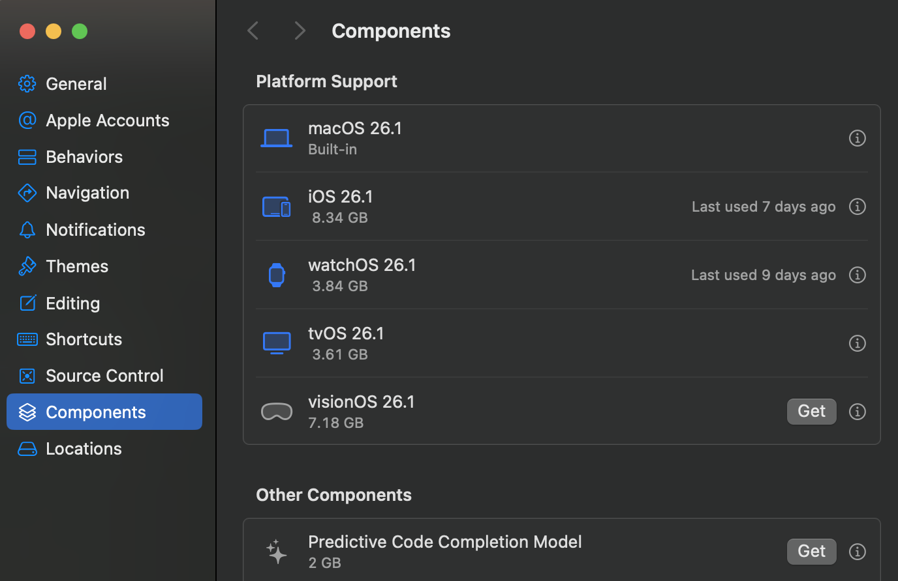
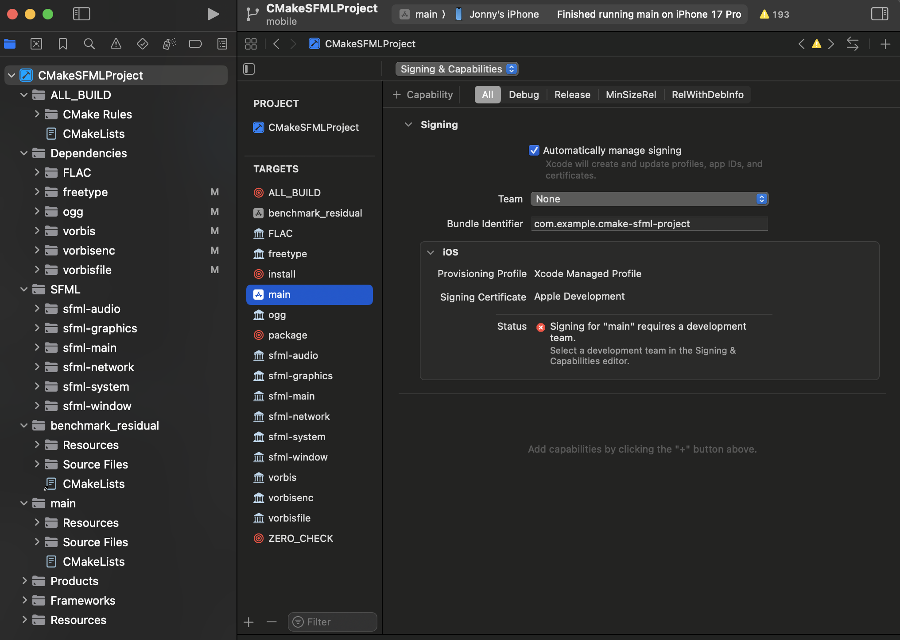

# SFML and iOS

## Introduction

This tutorial is the first one you should read if you want to build for iOS with SFML

!!! note

    The [CMake template](cmake.md) is the recommended way to get started with SFMLL, use the `mobile` branch to support iOS

## Setup

If you want to manually set up an xcode project for iOS and use SFML with it, the process is almost identical to the setup for [macOS](macos.md), however you will need to build the SFML binaries yourself as SFML does not currently offer them for download.

By far the easiest way to build for iOS is if you have an existing cmake project using SFML, or have started with the [CMake template project](cmake.md) (Make sure to use the `mobile` branch) So that is what this tutorial will cover

It is _strongly_ advised to use Xcode to build for iOS as it will handle the bundling, intalling, launching, and debugging of your app on either real iOS devices or simulators if you don't have a real device available, as well as many other features. You can easily install the latest version of xcode from the app store on any mac. It will give you the option to add iOS support and/or simulators on first launch, or if you have an existing xcode installation you can add them via the preferences



## Compiling and running an SFML app

CMake has first-class support for cross-compiling to iOS on your mac. You simply set the system name when configuring projects. Make sure to use the Xcode generator unless you are comfortable handling the packaging, installing, launching and debugging of the app yourself

`cmake -B build/ios -DCMAKE_SYSTEM_NAME=iOS -GXcode`

This will generate the xcode project file (`xcodeproj` extension) in the `build/ios` folder which you can open in xcode

If it isn't already, select your main executable (main in the screenshot below) from the target dropdown at the top, and also select which device you want to build/run on (an iPhone 17 Pro simulator here)


At this point you should be able to build and run your app on an iOS simulator

## Building and running for a real device
Real devices require some bundle properties to be set, which can be easily done via CMake

```cmake
set_target_properties(main PROPERTIES
    MACOSX_BUNDLE TRUE
    MACOSX_BUNDLE_BUNDLE_NAME "My SFML Project"
    MACOSX_BUNDLE_GUI_IDENTIFIER "com.me.my-project")
```

It will also require signing by a development team requiring an apple developer account if you wish to run on a real device. Once you have signed into your developer account in the xcode preferences you can select a development team on the "Signing and Capabilities" tab in the build settings

