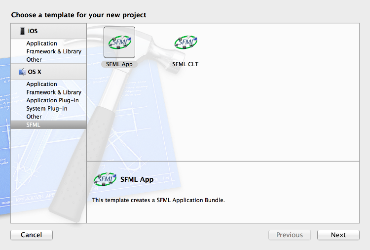
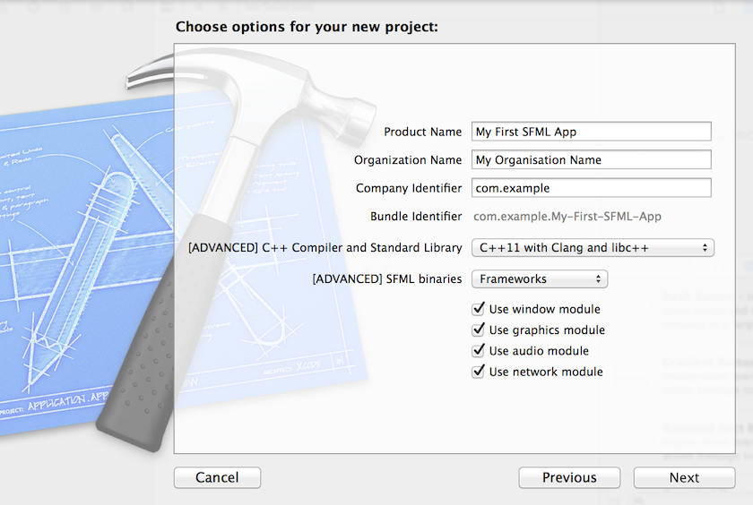
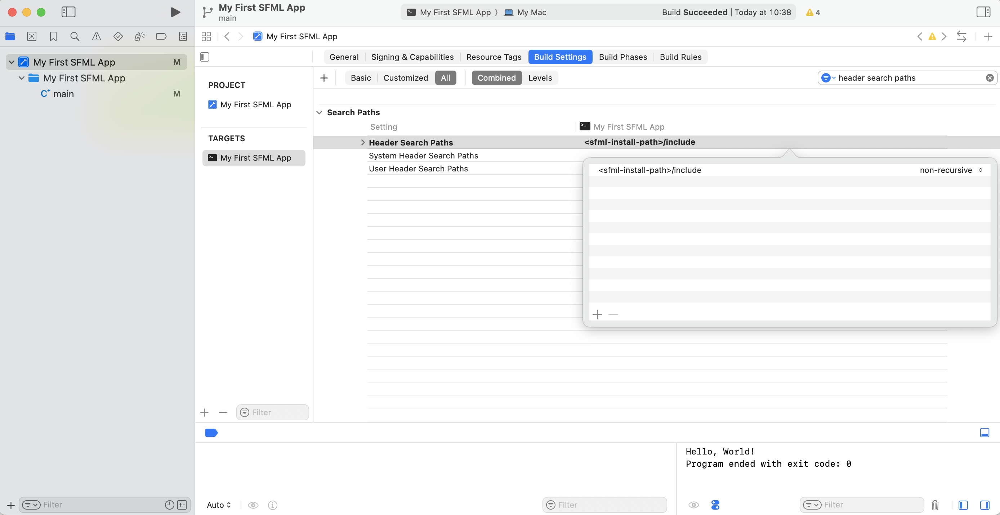
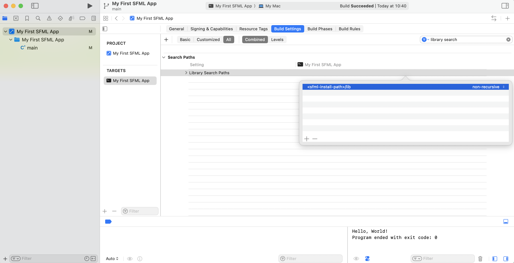
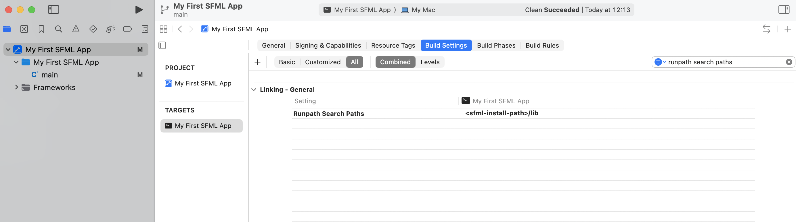
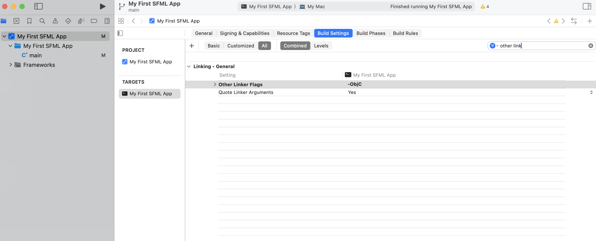

# SFML and Xcode (macOS)

## Introduction

!!! note

    The [CMake template](cmake.md) is the recommended way to get started with SFML, especially for iOS where SFML doesn't currently publish binaries

This tutorial will show you how to install SFML, set up your IDE and compile a basic SFML program for **macOS**.

You will see several external links in this document.
They are meant for further reading on specific topics for those who are curious; reading them isn't necessary to follow this tutorial.

### System requirements

All you need to create an SFML application is:

- An Intel Mac with Catalina or later (10.15+) or an Apple Silicon Mac with Big Sur or later (11+)
- [Xcode](https://developer.apple.com/xcode/ "Download Xcode") (Can also be installed via app store)
- Clang and libc++ (which are shipped by default with Xcode).

## Installing SFML

First of all you need to download the SFML SDK for your architecture which is available on the [download page](../../../download/index.md "Go to the download page"). You can then unpack this installation wherever you like and make a note of the path to use during the following setup (indicated by `<sfml-install-path>`)

You can also install SFML from [brew](https://brew.sh) by running `brew install sfml`

Then, in order to start developing SFML applications, you have to install the following items:

## Create your first SFML program

First select File > New Project... then Select the "Command line tool" template.



Now you can fill in the required fields as shown in the following screenshot.
When you are done click next and choose a folder location for your project.



Now you have a basic project with a `main.cpp` file for your code. You can replace the contents with this SFML code to draw a green circle:

```cpp
#include <SFML/Graphics.hpp>

int main()
{
    sf::RenderWindow window(sf::VideoMode({200, 200}), "SFML works!");
    sf::CircleShape shape(100.f);
    shape.setFillColor(sf::Color::Green);

    while (window.isOpen())
    {
        while (const std::optional event = window.pollEvent())
        {
            if (event->is<sf::Event::Closed>())
                window.close();
        }

        window.clear();
        window.draw(shape);
        window.display();
    }
}
```

But currently it will not build, as we need to configure Xcode so it can find SFML's headers and libraries

For header paths, select your project on the sidebar, go to the build settings tab and set the Header Search paths (filter can help find the setting) to the `include` folder in your unpacked SFML folder (or brew include folder if using brew, e.g. `/opt/homebrew/include`)



For library paths, do the same for the Library Search path setting, using the `lib` folder in your unpacked SFML folder (or brew lib folder if using brew, e.g. `/opt/homebrew/lib`)



Now the configuration is different whether you decide to use the dynamic or static libraries

### Dynamic libraries

To link libraries, Navigate to the "Build Phases" tab in your project settings, and under "Link Binary With Libraries" add SFML's libraries via `Add Other... -> Files`. For dynamic linking you want to select the files with the `dylib` extension


Your project should now build successfully, but will fail at runtime as it can't load the libraries. To fix this you need to provide the lib folder in the runpath search paths setting



### Static libraries

To use the static libraries, Navigate to the "Build Phases" tab in your project settings, and under "Link Binary With Libraries" add SFML's libraries via `Add Other... -> Files`, and the system frameworks SFML requires (which will show up in the default list), it should result in something like this:


Finally, as SFML utilises Objective-C classes you must add the `-ObjC` flag to ensure they are linked correctly, that goes in the build settings under "Other Linker flags"



## Running your program

You should now be able to build and run your program via the button near the top left, or the `⌘ + R` shortcut


