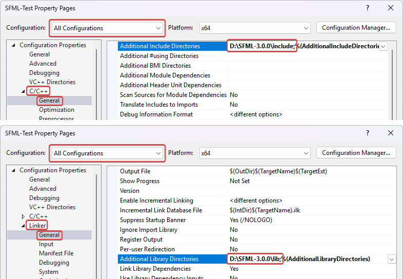
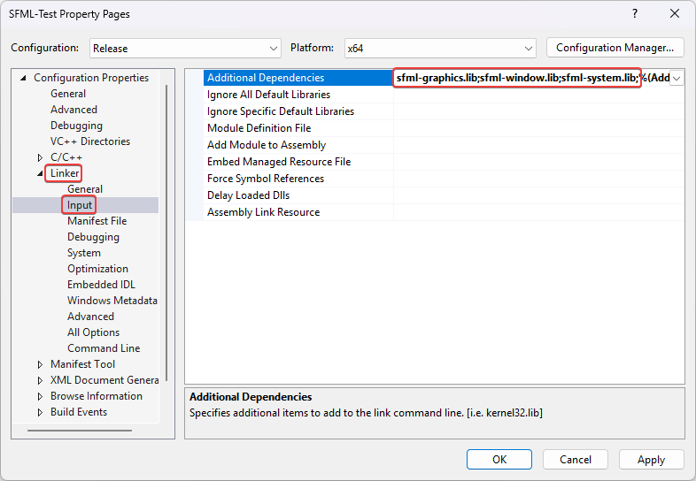
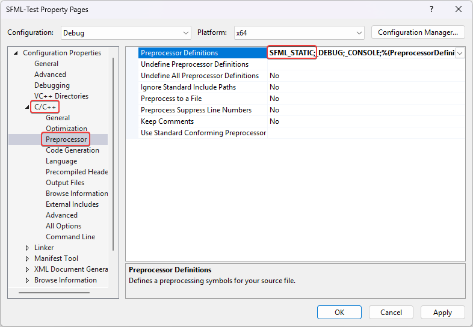
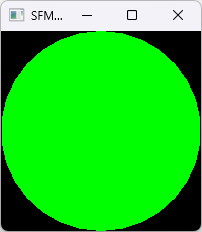

# SFML and Visual Studio

## Introduction

This tutorial is the first one you should read if you're using SFML with the Visual Studio IDE (Visual C++ compiler).
It will explain how to configure your SFML projects.

!!! note

    The [CMake template](cmake.md) is the recommended way to get started with SFML.

## Installing SFML

First, you must download the SFML SDK from the [download page](https://www.sfml-dev.org/download.php "Go to the download page").

You can then unpack the SFML archive wherever you like.
Copying headers and libraries to your installation of Visual Studio is not recommended, it's better to keep libraries in their own separate location, especially if you intend to use several versions of the same library, or several compilers.

## Creating and configuring an SFML project

The first thing to do is choose what kind of project to create.
It is recommended to select "Empty Project".
The dialog window offers a few other options to customize the project: select "Console application" or "Windows application" only if you know how to use pre-compiled headers.

For the purpose of this tutorial, you should create a `main.cpp` file and add it to the project, so that we have access to the C++ settings (otherwise Visual Studio doesn't know which language you're going to use for this project).
We'll explain what to put inside later.

Now we need to tell the compiler where to find the SFML headers (.hpp files), and the linker where to find the SFML libraries (.lib files).

In the project's properties, add:

- The path to the SFML headers (_<sfml-install-path>/include_) to C/C++ > General > Additional Include Directories
- The path to the SFML libraries (_<sfml-install-path>/lib_) to Linker > General > Additional Library Directories

These paths are the same in both Debug and Release configuration, so you can set them globally for your project ("All configurations").



The next step is to link your application to the SFML libraries (.lib files) that your code will need.
SFML is made of 5 modules (system, window, graphics, network and audio), and there's one library for each of them.

Libraries must be added in the project's properties, in Linker > Input > Additional Dependencies.
Add all the SFML libraries that you need, for example "sfml-graphics.lib", "sfml-window.lib" and "sfml-system.lib".



It is important to link to the libraries that match the configuration: "sfml-xxx-d.lib" for Debug, and "sfml-xxx.lib" for Release.
A bad mix may result in crashes.

The settings shown here will result in your application being linked to the dynamic version of SFML, the one that needs the DLL files.
If you want to get rid of these DLLs and have SFML directly integrated into your executable, you must link to the static version.
Static SFML libraries have the "-s" suffix: "sfml-xxx-s-d.lib" for Debug, and "sfml-xxx-s.lib" for Release.


In this case, you'll also need to define the `SFML_STATIC` macro in the preprocessor options of your project.



When static linking, you will have to link all of SFML's dependencies to your project as well.
This means that if you are linking sfml-window-s.lib or sfml-window-s-d.lib for example, you will also have to link opengl32.lib, winmm.lib and gdi32.lib.
Some of these dependency libraries might already be listed under "Inherited values", but adding them again yourself shouldn't cause any problems.

Here are the dependencies of each module, append the -d as described above if you want to link the SFML debug libraries:

| Module                | Dependencies                                                                                                            |
| --------------------- | ----------------------------------------------------------------------------------------------------------------------- |
| `sfml-graphics-s.lib` | - sfml-window-s.lib<br>- sfml-system-s.lib<br>- opengl32.lib<br>- freetype.lib                                          |
| `sfml-window-s.lib`   | - sfml-system-s.lib<br>- opengl32.lib<br>- winmm.lib<br>- gdi32.lib                                                     |
| `sfml-audio-s.lib`    | - sfml-system-s.lib<br>- flac.lib<br>- vorbisenc.lib<br>- vorbisfile.lib<br>- vorbis.lib<br>- ogg.lib |
| `sfml-network-s.lib`  | - sfml-system-s.lib<br>- ws2_32.lib                                                                                     |
| `sfml-system-s.lib`   | - winmm.lib                                                                                                             |

You might have noticed from the table that SFML modules can also depend on one another, e.g. sfml-graphics-s.lib depends both on sfml-window-s.lib and sfml-system-s.lib.
If you static link to an SFML library, make sure to link to the dependencies of the library in question, as well as the dependencies of the dependencies and so on.
If anything along the dependency chain is missing, you *will* get linker errors.

If you are slightly confused, don't worry, it is perfectly normal for beginners to be overwhelmed by all this information regarding static linking.
If something doesn't work for you the first time around, you can simply keep trying always bearing in mind what has been said above.
If you still can't get static linking to work, you can check the [FAQ](https://www.sfml-dev.org/faq.php#build-link-static "Go to the FAQ page") and the [forum](http://en.sfml-dev.org/forums/index.php?board=4.0 "Go to the general help forum") for threads about static linking.

If you don't know the differences between dynamic (also called shared) and static libraries, and don't know which one to use, you can search for more information on the internet.
There are many good articles/blogs/posts about them.

Your project is ready, let's write some code now to make sure that it works.
Put the following code inside the `main.cpp` file:

```cpp
#include <SFML/Graphics.hpp>

int main()
{
    sf::RenderWindow window(sf::VideoMode({200, 200}), "SFML works!");
    sf::CircleShape shape(100.f);
    shape.setFillColor(sf::Color::Green);

    while (window.isOpen())
    {
        while (const std::optional event = window.pollEvent())
        {
            if (event->is<sf::Event::Closed>())
                window.close();
        }

        window.clear();
        window.draw(shape);
        window.display();
    }
}
```

If you chose to create a "Windows application" project, the entry point of your code has to be set to "WinMain" instead of "main".
Since it's Windows specific, and your code would therefore not compile on Linux or macOS, SFML provides a way to keep a standard "main" entry point in this case: link your project to the sfml-main module ("sfml-main-d.lib" in Debug, "sfml-main.lib" in Release), the same way you linked sfml-graphics, sfml-window and sfml-system.

Compile it, and if you linked to the dynamic version of SFML, don't forget to copy the SFML DLLs to same directory as your compiled executable.
They are in the bin/ directory of your SFML installation.
Run it, and if everything works you should see this:


