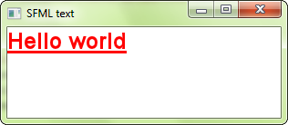

# Text and fonts

## Loading a font

Before drawing any text, you need to have an available font, just like any other program that prints text.
Fonts are encapsulated in the [`sf::Font`](../../../documentation/3.0.1/classsf_1_1Font.html "sf::Font documentation") class, which provides three main features: loading a font, getting glyphs (i.e. visual characters) from it, and reading its attributes.
In a typical program, you'll only have to make use of the first feature, loading the font, so let's focus on that first.

The most common way of loading a font is from a file on disk, which is done with the `openFromFile` function or its corresponding constructor.

```cpp
sf::Font font("arial.ttf"); // Throws sf::Exception if an error occurs

// OR

sf::Font font;
if (!font.openFromFile("arial.ttf"))
{
    // error...
}
```

Note that SFML won't load your system fonts automatically, i.e. `font.openFromFile("Courier New")` won't work.
Firstly, because SFML requires _file names_, not font names, and secondly because SFML doesn't have magical access to your system's font folder.
If you want to load a font, you will need to include the font file with your application just like every other resource (images, sounds, ...).

The `openFromFile` function or the corresponding constructor can sometimes fail with no obvious reason.
First, check the error message that SFML prints to the standard output (check the console).
If the message is unable to open file, make sure that the _working directory_ (which is the directory that any file path will be interpreted relative to) is what you think it is: When you run the application from your desktop environment, the working directory is the executable folder.
However, when you launch your program from your IDE (Visual Studio, Code::Blocks, ...) the working directory might sometimes be set to the _project_ directory instead.
This can usually be changed quite easily in the project settings.

You can also load a font file from memory (`openFromFile`), or from a [custom input stream](../system/stream.md "Input streams tutorial") (`openFromStream`).
Corresponding constructors exist with the same parameters that throw an exception upon failure.

SFML supports most common font formats.
The full list is available in the API documentation.

That's all you need to do.
Once your font is loaded, you can start drawing text.

## Drawing text

To draw text, you will be using the [`sf::Text`](../../../documentation/3.0.1/classsf_1_1Text.html "sf::Text documentation") class.
It's very simple to use:

```cpp
sf::Text text(font); // a font is required to make a text object

// set the string to display
text.setString("Hello world");

// set the character size
text.setCharacterSize(24); // in pixels, not points!

// set the color
text.setFillColor(sf::Color::Red);

// set the text style
text.setStyle(sf::Text::Bold | sf::Text::Underlined);

...

// inside the main loop, between window.clear() and window.display()
window.draw(text);
```



Text can also be transformed: They have a position, an orientation, and a scale.
The functions involved are the same as for the [`sf::Sprite`](../../../documentation/3.0.1/classsf_1_1Sprite.html "sf::Sprite documentation") class and other SFML entities.
They are explained in the [Transforming entities](transform.md "'Transforming entities' tutorial") tutorial.

## How to avoid problems with non-ASCII characters?

Handling non-ASCII characters (such as accented European, Arabic, or Chinese characters) correctly can be tricky.
It requires a good understanding of the various encodings involved in the process of interpreting and drawing your text.
To avoid having to bother with these encodings, there's a simple solution: Use _wide literal strings_.

```cpp
text.setString(L"יטאח");
```

It is this simple "L" prefix in front of the string that makes it work by telling the compiler to produce a wide string.
Wide strings are a strange beast in C++: the standard doesn't say anything about their size (16-bit? 32-bit?), nor about the encoding that they use (UTF-16? UTF-32?).
However we know that on most platforms, if not all, they'll produce Unicode strings, and SFML knows how to handle them correctly.

Note that the C++11 standard supports new character types and prefixes to build UTF-8, UTF-16 and UTF-32 string literals.

It may seem obvious, but you also have to make sure that the font that you use contains the characters that you want to draw.
Indeed, fonts don't contain glyphs for all possible characters (there are more than 100,000 in the Unicode standard!).
An Arabic font won't be able to display Japanese text, for example.

## Making your own text class

If [`sf::Text`](../../../documentation/3.0.1/classsf_1_1Text.html "sf::Text documentation") is too limited, or if you want to do something else with pre-rendered glyphs, [`sf::Font`](../../../documentation/3.0.1/classsf_1_1Font.html "sf::Font documentation") provides everything that you need.

You can retrieve the texture which contains all the pre-rendered glyphs of a certain size:

```cpp
const sf::Texture& texture = font.getTexture(characterSize);
```

It is important to note that glyphs are added to the texture when they are requested.
There are so many characters (remember, more than 100,000) that they can't all be generated when you load the font.
Instead, they are rendered on the fly when you call the `getGlyph` function (see below).

To do something meaningful with the font texture, you must get the texture coordinates of glyphs that are contained in it:

```cpp
sf::Glyph glyph = font.getGlyph(character, characterSize, bold);
```

`character` is the UTF-32 code of the character whose glyph that you want to get.
You must also specify the character size, and whether you want the bold or the regular version of the glyph.

The [`sf::Glyph`](../../../documentation/3.0.1/structsf_1_1Glyph.html "sf::Glyph documentation") structure contains three data members of interest.

- `advance` is the horizontal offset to apply to get the starting position of the next glyph in the text
- `bounds` contains the bounding rectangle of the glyph, which helps position it relative to the baseline of the text
- `textureRect` contains the texture coordinates of the glyph within the texture

You can also get some of the font's other metrics, such as the kerning between two characters or the line spacing (always for a certain character size):

```cpp
float lineSpacing = font.getLineSpacing(characterSize);

float kerning = font.getKerning(character1, character2, characterSize);
```
