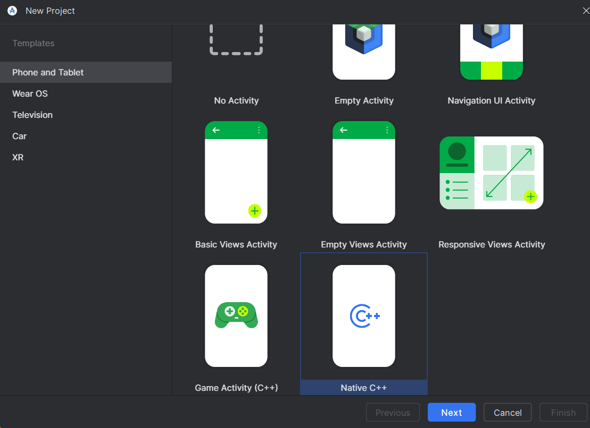
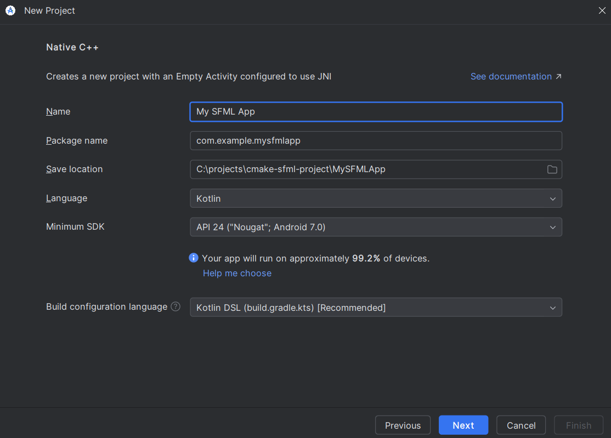

# SFML and Android

## Introduction

This tutorial is the first one you should read if you're using SFML on Android.
It will explain how to install SFML, and compile projects that use it.

!!! note

    The [CMake template](cmake.md) is the recommended way to get started with SFML, use the `mobile` branch to support android.

## Installing SFML

For the best experience it's generally preferable to include SFML as part of your CMake project, which means it's not necessary to install SFML and you can use the Gradle CMake support to build your project without much extra setup.
This is what the android SFML examples do (`examples/projects/android` in the SFML source tree).

If you do instead want to install the SFML binaries and link them from your project, SFML will override the install prefix when building from source so that the binaries are installed to the SDK, and you can link them from your project.
There is an example of this in the SFML source tree under `examples/android`.

## Compiling an SFML program

While it is technically possible to build native-only binaries on Android, as SFML does for its unit tests, you can't use any windowing/graphics and aren't able to handle any user input, so for the vast majority of cases you will want to build a proper Android application, which is what this tutorial covers.

Again, it is technically possible to build an Android app without Gradle or Android Studio, but you have to do all the app packaging yourself and it generally makes things significantly more difficult than they need to be, so this tutorial covers the simplest approach using Android Studio to build an app (via Gradle).
This also gives you an IDE and a debugger for developing your Android app.

So first, download and install [Android Studio](https://developer.android.com/studio).
The latest version with the default setup should give you all the tools you need to build an SFML app.

Once installed, create a new project and select native C++.



In most cases the default options are fine, so just give your app a name, click next, then finish.



This new project will have some files that aren't necessary, so you can delete the following:

- `MainActivity.kt`
- `androidTest` folder
- `test` folder
- `res` folder

Once that's done, you can sync the Gradle project (it will show a warning at the top that it needs syncing, with a button you can press), which should sync successfully.

This template will include a basic `native-lib.cpp` file and `CMakeLists.txt`, which is your C++ SFML project code.
If you are porting an existing SFML app to Android, then you can delete these files, if not, add this block to the `CMakeLists.txt` file to build and link SFML to your app.

```cmake
include(FetchContent)
FetchContent_Declare(SFML
        GIT_REPOSITORY https://github.com/SFML/SFML.git
        GIT_TAG 3.1.0
        GIT_SHALLOW ON
        EXCLUDE_FROM_ALL
        SYSTEM)
FetchContent_MakeAvailable(SFML)

target_link_libraries(${CMAKE_PROJECT_NAME} SFML::Graphics SFML::Main)
```

You will also need to modify the `externalNativeBuild` block in the app's Gradle file to use the higher version of CMake required by SFML.
If you are porting an existing SFML project this is also where you would change the path to use your existing `CMakeLists.txt` file instead of the one from the template.

```kotlin
externalNativeBuild {
    cmake {
        path = file("src/main/cpp/CMakeLists.txt")
        version = "3.28.0+"
    }
}
```

Now if you sync the Gradle project again, it will configure your CMake project including SFML, and pressing the build button, will build and run the CMake build step alongside the other parts of the Android build process.

!!! note

    Instead of a typical C++ executable, the main Android application process runs in Java and loads native c++ code from a shared library. For most intents and purposes this means you can just replace `add_executable(...)` in CMake with `add_library(... SHARED)` for Android. See [here](https://developer.android.com/ndk/guides/concepts#main_components) for more details.

### Activity setup

The final step to create a working Android app is to set up the activity.
All android apps require an activity, but there is a built-in native activity class which is useful for projects that are primarily native C++ code, and that is what SFML will hook into.

To use a native activity, open the `AndroidManifest.xml` in your project and replace it with the following contents:

```xml
<?xml version="1.0" encoding="utf-8"?>
<manifest xmlns:android="http://schemas.android.com/apk/res/android">

    <application
        android:allowBackup="true"
        android:label="mysfmlapp"
        android:supportsRtl="true">
        <activity
            android:name="android.app.NativeActivity"
            android:exported="true">
            <meta-data android:name="android.app.lib_name"
                        android:value="mysfmlapp" />
            <intent-filter>
                <action android:name="android.intent.action.MAIN" />

                <category android:name="android.intent.category.LAUNCHER" />
            </intent-filter>
        </activity>
    </application>

</manifest>
```

`mysfmlapp` above is generated from the project name when creating the template (check the `CMakeLists.txt` file if you are not sure), and if you are porting an existing SFML project, it should be the name of your main SFML target library (which would be the executable for other platforms).

If you are creating a new project, replace the contents of `native-lib.cpp` with the following code:

```cpp
#include <SFML/Graphics.hpp>
#include <SFML/Main.hpp>

int main()
{
    sf::RenderWindow window(sf::VideoMode({200, 200}), "SFML works!");
    sf::CircleShape shape(100.f);
    shape.setFillColor(sf::Color::Green);

    while (window.isOpen())
    {
        while (const std::optional event = window.pollEvent())
        {
            if (event->is<sf::Event::Closed>())
                window.close();
        }

        window.clear();
        window.draw(shape);
        window.display();
    }
}
```

Now you should be able to launch or debug your app on an Android device or simulator, and see the green circle.